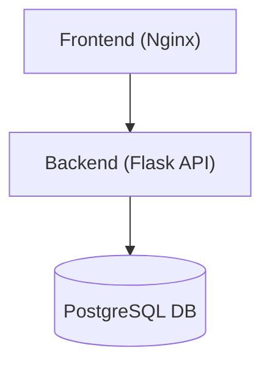

# 🧩 Docker 3-Tier Task Manager (with CI/CD)

A **production-style 3-tier web application** demonstrating containerized deployment, CI/CD automation, and multi-service networking using **Docker Compose**.

This project simulates a real-world DevOps pipeline — from local development to automated build, push, and deployment — using **Flask**, **PostgreSQL**, and **Nginx**.

---

## 🚀 Architecture Overview

```
Frontend (Nginx + HTML/JS)
          │
          ▼
Backend (Flask REST API)
          │
          ▼
Database (PostgreSQL)
```

- **Frontend:** Static UI served by `nginx:alpine`, communicating internally with the backend.  
- **Backend:** Flask REST API container providing CRUD endpoints.  
- **Database:** PostgreSQL container with persistent volume storage.  
- **Networking:** All services share a private Docker network; only port 80 is exposed externally.

---

## 🧱 Tech Stack

| Layer | Technology | Description |
|-------|-------------|-------------|
| Frontend | Nginx + HTML, CSS, JS | Serves static UI and proxies API requests |
| Backend | Python Flask | REST API for task management |
| Database | PostgreSQL | Stores task data persistently |
| Orchestration | Docker Compose | Manages multi-service container setup |
| CI/CD | GitHub Actions | Builds, pushes, and deploys automatically |

---

## 🧩 Docker Compose Services

| Service | Image | Ports | Description |
|----------|--------|--------|-------------|
| `frontend` | nginx:alpine | 80:80 | Serves the UI |
| `backend` | `mohamed7419/taskmanager-backend:latest` | internal:5000 | Flask API service |
| `db` | postgres:13 | internal:5432 | Persistent PostgreSQL instance |

> The backend image is built and pushed to Docker Hub via CI/CD.

---

## ⚙️ Local Setup & Run

### 1️⃣ Clone the repository
```bash
git clone https://github.com/Mohamed-Abdalla19/docker-3tier-task-manager.git
cd docker-3tier-task-manager
```

### 2️⃣ Create `.env` file
```bash
cp .env.example .env
```

### 3️⃣ Build and run
```bash
docker-compose up --build
```

### 4️⃣ Access the app
Visit **[http://localhost](http://localhost)**  

You can:
- ➕ Add tasks  
- ❌ Delete tasks  
- 🔄 Instantly see changes  

---

## 🚀 CI/CD Pipeline (GitHub Actions)

This project uses **GitHub Actions** for continuous delivery:

### Workflow Summary:
1. **Build & Push**  
   - The backend image is built from `./backend`.  
   - The image is pushed to Docker Hub (`mohamed7419/taskmanager-backend:latest`).

2. **Remote Deploy**  
   - SSHs into your server (Docker already installed).  
   - Copies project files (`docker-compose.yaml`, frontend, `.env.example`).  
   - Generates `.env` on the remote machine (`cp .env.example .env`).  
   - Runs `docker-compose pull` and `docker-compose up -d`.

### Required Secrets:
| Name | Description |
|------|-------------|
| `DOCKERHUB_USERNAME` | Docker Hub username |
| `DOCKERHUB_TOKEN` | Docker Hub access token |
| `SERVER_IP` | Target VPS IP |
| `SERVER_USER` | SSH username |
| `SERVER_SSH_KEY` | SSH private key for deployment |

---

## 🗂️ File Structure

```
docker-3tier-task-manager/
│
├── backend/
│   ├── app.py
│   ├── requirements.txt
│   └── Dockerfile
│
├── frontend/
│   ├── index.html
│   ├── nginx.conf
│
├── .env.example
├── docker-compose.yml
├── .github/
│   └── workflows/
│       └── deploy.yml
└── README.md
```

---

## 🧠 Features

✅ Fully containerized 3-tier stack  
✅ Secure `.env` templating with `.env.example`  
✅ Persistent PostgreSQL volume  
✅ Internal networking between services  
✅ Healthchecks for reliable startup  
✅ Automated CI/CD (build → push → deploy)  
✅ Minimal configuration — works locally or remotely  

---

## 🧾 API Endpoints

| Method | Endpoint | Description |
|--------|-----------|-------------|
| GET | `/api/tasks` | Retrieve all tasks |
| POST | `/api/add` | Add a new task |
| DELETE | `/api/delete/<id>` | Delete a task by ID |

Example request:
```bash
curl -X POST http://localhost/api/add -H "Content-Type: application/json" -d '{"title": "Buy milk"}'
```

---

## 🧭 Architecture Diagram



---

## 🧰 Useful Commands

```bash
# Stop all containers
docker-compose down

# Stop and remove volumes
docker-compose down -v

# View backend logs
docker-compose logs -f backend
```

---

## ☁️ Deployment on AWS

This project is **deployed on an AWS EC2 instance** using **Docker Compose**, demonstrating real-world cloud deployment and CI/CD automation.

The backend image is built and pushed to **Docker Hub** through a GitHub Actions workflow, and then automatically deployed to the EC2 instance via SSH.

### 🧩 Deployment Architecture
- **AWS EC2 (Ubuntu)** instance running Docker & Docker Compose  
- **Backend (Flask)** image pulled from Docker Hub  
- **Frontend (Nginx)** serving static content on port 80  
- **PostgreSQL** database container with persistent storage  
- **GitHub Actions** handling automated build, push, and redeploy  

### 🌍 Live Demo
The application is live and accessible at:  
👉 [http://51.21.196.60](http://51.21.196.60)

> ⚠️ Note: This demo runs on a public AWS EC2 instance for demonstration purposes only.  

---

## 👨‍💻 Author

**Mohamed Mostafa**  
DevOps Engineer  
📫 [LinkedIn](https://www.linkedin.com/in/mohamed-mostafa19) • [GitHub](https://github.com/Mohamed-Abdalla19)

---

### 🧭 Summary

This project demonstrates:
- A real-world **3-tier web architecture** (Frontend, Backend, Database)  
- Complete **CI/CD automation** using **GitHub Actions** and **Docker Hub**  
- **Cloud deployment** on **AWS EC2** using **Docker Compose**  
- Secure and reusable environment configuration with `.env` templates  
- Internal container networking and persistent data storage  
- Production-style setup with **automated build, push, and redeploy** steps
