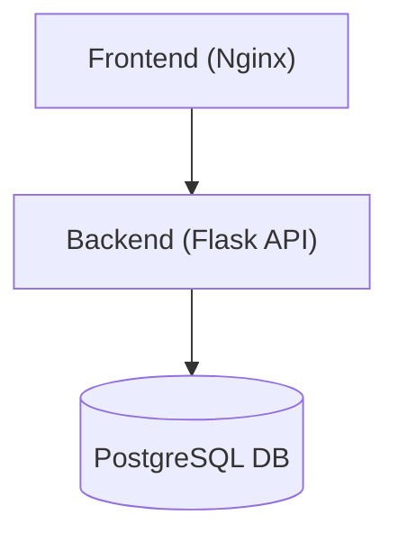

# 🧩 Docker 3-Tier Task Manager

A lightweight **3-tier web application** demonstrating Docker, container orchestration, and multi-service communication using **Docker Compose**.

This project showcases a **real-world DevOps setup** with separate containers for the frontend, backend API, and database — all running and communicating within a single Docker network.

---

## 🚀 Project Overview

**Architecture:**

```
Frontend (Nginx + HTML/JS)
          │
          ▼
Backend (Flask REST API)
          │
          ▼
Database (PostgreSQL)
```

- **Frontend** — Static website served by `nginx:alpine`
- **Backend** — Flask REST API container providing CRUD endpoints (`/tasks`, `/add`, `/delete/<id>`)
- **Database** — PostgreSQL container with persistent volume storage
- **Networking** — All containers communicate internally using Docker’s bridge network (only port 80 is exposed externally)

---

## 🧱 Tech Stack

| Layer | Technology | Description |
|--------|-------------|-------------|
| Frontend | HTML, CSS, JavaScript | Clean UI served via Nginx |
| Backend | Python Flask | REST API providing CRUD functionality |
| Database | PostgreSQL | Stores task data persistently |
| Orchestration | Docker Compose | Manages all three services together |

---

## ⚙️ Setup & Run

### 1️⃣ Clone the repository
```bash
git clone https://github.com/Mohamed-Abdalla19/docker-3tier-task-manager.git
cd docker-3tier-task-manager
```

### 2️⃣ Set up environment variables
This project uses a `.env` file for configuration (database name, password, etc.).  
For security reasons, the actual `.env` is **not included** in the repo.  

Copy the provided example file and adjust values if needed:
```bash
cp .env.example .env
```

Example content:
```bash
POSTGRES_USER=postgres
POSTGRES_PASSWORD=your_password
POSTGRES_DB=tasks_db

DB_HOST=db
DB_NAME=tasks_db
DB_USER=postgres
DB_PASS=your_password
```

### 3️⃣ Build and start the containers
```bash
docker-compose up --build
```

### 4️⃣ Open the app
Visit **[http://localhost](http://localhost)** in your browser.

You can now:
- ➕ Add new tasks  
- ❌ Delete existing tasks  
- 🔄 See the updated list instantly  

---

## 🧩 Docker Compose Services

| Service | Image | Ports | Description |
|----------|--------|--------|-------------|
| `frontend` | nginx:alpine | 80:80 | Serves the UI and proxies `/api` requests to backend |
| `backend` | python:3.9-slim (built locally) | internal:5000 | Flask REST API for task operations |
| `db` | postgres:13 | internal:5432 | Persistent PostgreSQL database |

---

## 🗂️ File Structure

```
docker-3tier-task-manager/
│
├── backend/
│   ├── app.py
│   ├── requirements.txt
│   └── Dockerfile
│
├── frontend/
│   ├── index.html
│   ├── nginx.conf
│
├── .env.example
├── docker-compose.yml
└── README.md
```

---

## 🧠 Features

✅ 3-tier containerized architecture  
✅ Internal networking between services  
✅ Persistent PostgreSQL volume  
✅ Healthchecks for reliable startup  
✅ Simple CRUD operations (Add / View / Delete)  
✅ Fast frontend iteration using `nginx:alpine` and volume mounts  
✅ Secure `.env` management with `.env.example` template  

---

## 🧰 Useful Commands

```bash
# Stop all containers
docker-compose down

# Stop and remove volumes (reset DB)
docker-compose down -v

# View backend logs
docker-compose logs -f backend
```

---

## 🧾 API Endpoints

| Method | Endpoint | Description |
|--------|-----------|-------------|
| GET | `/api/tasks` | Retrieve all tasks |
| POST | `/api/add` | Add a new task (`{ "title": "Buy milk" }`) |
| DELETE | `/api/delete/<id>` | Delete a task by ID |

---

## 🧭 Architecture Diagram


---

## 👨‍💻 Author

**Mohamed Mostafa**  
DevOps Engineer  
📫 [LinkedIn](www.linkedin.com/in/mohamed-mostafa19) • [GitHub](https://github.com/Mohamed-Abdalla19)

---

### 🧭 Summary

This project demonstrates how to:
- Containerize a 3-tier web application  
- Orchestrate multiple services using Docker Compose  
- Manage environment configuration securely with `.env`  
- Enable internal container networking and healthchecks  
